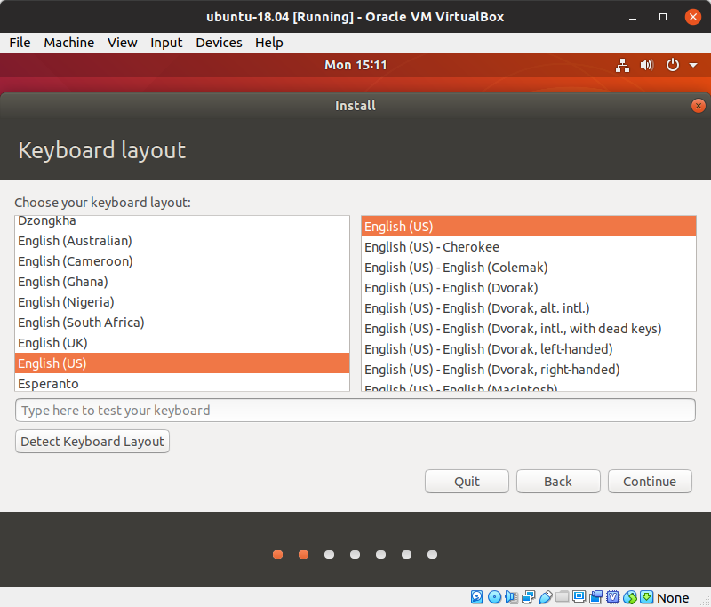

# Building a Ubuntu Desktop Virtual Machine with VirtualBox

## Definitions
- **Host:** - The host machine is the machine you install VirtualBox on. This will be a Linux, Mac or Windows machine running directly on the machines hardware
- **Guest:** - The guest machine is the virtual machine

## Prerequisetes

### Memory

The short answer: 16 GB is plenty. 8 GB is likely enough. 4 GB isn't enough. 

If you are going to be doing development on the guest you'll need to give the guest 4 to 6 GB of memory. Check you host system after a fresh boot to see how much free memory it has. The equasion isn't really 'host memory after boot' + '4 to 6 for guest' = 'amount of memory on host' as need a little extra is always needed.

### Processor

Any processor, Intel or AMD, made in the last 10 years probably good.

### Free hard drive space
25 GB should be enough for the guest, but remember a full disk runs slow and it is best to have 25% of the disk unused.

## Download Ubuntu 19.04 Desktop LTS
- Go to: https://www.ubuntu.com/download/desktop
- Click 'Download' next to Ubuntu 18.04 LTS
- Wait for the download to complete or, if you have the bandwidth, move on to the next step while it downloads.

> Ubuntu 19.04 is beautiful to look at compared to 18.04, but it is a short-term release and therefore not widly supported by all of the apps and tools you will need.

## Installing VirtualBox
Go to the [VirtualBox download page](https://www.virtualbox.org/wiki/Downloads) and download the package for your host OS. Then follow the usuall installation proceedure for your host OS.

## Create the VM
- Select Machine > New

### Name and operating system
  - Name: something short and to the point
  - Machine Folder: the default is good
  - Type: Linux
  - Version: Ubuntu (64-bit)
  - Click Next

### Memory Size
  How much memory you allocate to the guest machine depends on how much memory you have on the host and what you will use the VM for. With 16 GB on my host I allocate 6 GB to the guest and can do software development with MongoDB running locally. I haven't experimented but my guess is 4 GB is enough.
  - Enter the memory in MB (e.g., 6 * 1024 MB = 6144 or 6 GB)
  - Click Next

### Hard disk
  - Use the default: 'Create a virtual hard disk now'
  - Click Create

### Hard disk file type
  - Use the default: 'VDI (VirtualBox Disk Image)'
  - Click ?

### Storeage and physical hard disk
  - Use the default 'Dynamically allocated'
  - Click Next

      

### File location and size
  'Dynamically allocated', chosen in the previous step, means the file size of the VM's hard drive will start at the minimum needed and grow as necessary up to the size you set in the current screen. This means you could enter 100 GB here and the initial size will still be under 3 GB. 100 GB would be the maximum size it can grow to. I recommend putting in a large number but something significantly less then the available space on your host's hard drive.
  - Leave the location as is
  - Enter a size (eg. 100.00 GB)
  - Click Create
  file-location-and-size

You now have a VM with no operating system. You'll install one in the steps that follow.

- In the left pane, double click the the VM you just created or select it and click Start

### Select start-up disk
- Click the filder icon and navigate to the ubuntu ISO file you downloaded
- Click Start

### Welecome
- Click Install Ubuntu

### Keyboard layout
- Select your desired keyboard layout and click Continue

### Updates and other software
'Normal installation' will give you a full featured desktop experience with word processor, spreasheet, media player and much more. 'Minimal installation' is, well, fewer applications but perfectly good for software development. If you are curious about the full Ubuntu experience, choose 'Normal installation'. If you want to save space choose 'Minimal installation'. You can always install additional software later.

With Ubuntu 16.04, the last long term release, I experienced the build hanging if 'Download updates while installing ubuntu' was checked and suggest you leave it unchecked.

'Install third-party software for graphics and Wi-Fi hardware and additional media formats' is generally beneficial. Make it checked.

- Make desired selections
- Click Continue

### Installation type
- Take the defaults
- Click Install Now

### Write the changes to disks?
- Click Continue

### Where are you?
- Select your timezone
- Click Continue

### Who are you?
- Your name: Enter any name
- Your computer's name: The most noticable palce this will show-up is on the command line. Enter a name for your computer.
- Pick a username: This will be the name of the first user created and will also show-up on the command line. Enter your username.
- Choose a password: Enter a password
- Confirm your password: Re-enter the password
- Click 'Log in automatically' or 'Require my password to log in' - your choice

> NOTE: By default, the VM will not accept any incoming requests/conections. I also have a firewall on my host and, no surprise, my local network is behind a router. Additionally, if the host is locked, noone can log in to the guest without the host password. Given all of that, I choose the convenience of using a short 4 character password, that isn't super secret at all, as well as 'Log in automatically'.

## Installation will now begin.

### Installation Complete

### Press Enter

## All Done!

You now have a Ubuntu Virtual Machine. Enjoy!

  

