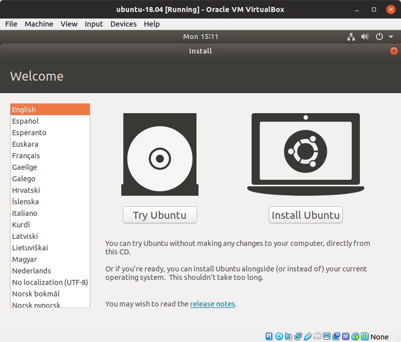

# Building a Ubuntu Desktop Virtual Machine with VirtualBox

There are many reasons why you would want to build a Linux virtual machine. Here are a few of them: 
- You may be curious about a different operating system
- You a Windows or Mac user and you think or heard you _should_ learn it.
- You want to run a web and/or database server on Linux.
- Your app will run on Linux in production and you want to do development on Linux as well to reduce the complications of deployment.
- You are already a Linux user and want to experiment in some way without modifying your development machine.

## Definitions

A couple of words used frequently below:

- **Host:** - The host machine is the machine you install VirtualBox on. This will be a Linux, Mac or Windows machine running directly on the machines hardware.
- **Guest:** - The guest machine is the virtual machine.


## Prerequisetes

### Memory

The short answer: 16 GB is plenty. 8 GB is likely enough. 4 GB isn't enough. 

If you are going to be doing development on the guest you'll need to give the guest 4 to 6 GB of memory. Check you host system after a fresh boot to see how much free memory it has. The equation isn't really 'host memory after boot' + '4 to 6 for guest' = 'amount of memory on host'. A little extra is always needed.

If you are short on memory you can dual-boot your machine. There are many good articles on how to do this. Try Googeling 'ubuntu 18.04 dual boot'.

### Processor

Any multi-core processor, Intel or AMD, made in the last 8 to 10 years is probably good.

### Free hard drive space on host
25 GB should be enough for the guest, but remember a full disk runs slow and it is best to have 25% of the host disk unused.

## Download Ubuntu 18.04 Desktop LTS
- Go to: https://www.ubuntu.com/download/desktop
- Click 'Download' next to Ubuntu 18.04 LTS
- Wait for the download to complete or, if you have the bandwidth, move on to the next step while it downloads.

> Ubuntu 19.04 is beautiful to look at compared to 18.04, but it is a short-term release and therefore not widly supported by all of the apps and tools you will need.

## Installing VirtualBox
Go to the [VirtualBox download page](https://www.virtualbox.org/wiki/Downloads) and download the package for your host OS. Then follow the usuall installation proceedure for your host OS.


## Create the VM

- Select Machine > New

### Name and operating system
  - Name: something short and to the point
  - Machine Folder: the default is good
  - Type: Linux
  - Version: Ubuntu (64-bit)
  - Click Next


### Memory Size
  How much memory you allocate to the guest machine depends on how much memory you have on the host and what you will be doing with the VM for. With 16 GB on my host I allocate 6 GB to the guest and can do software development with MongoDB running locally. I haven't experimented but my guess is 4 GB is enough.
  - Enter the memory in MB (e.g., 6 * 1024 MB = 6144 or 6 GB)
  - Click Next


### Hard disk
  - Use the default: 'Create a virtual hard disk now'
  - Click Create


### Hard disk file type
  - Use the default: 'VDI (VirtualBox Disk Image)'
  - Click Next


### Storeage and physical hard disk
  - Use the default 'Dynamically allocated'
  - Click Next

      

### File location and size
  'Dynamically allocated', chosen in the previous step, means the file size of the VM's hard drive will start at the minimum needed and grow as necessary up to the size you set in the current screen. This means you could enter 100 GB here and the initial size will still be under 3 GB. 100 GB would be the maximum size it can grow to. I recommend putting in a large number but something significantly less then the available space on your host's hard drive.
  - Leave the location as is
  - Enter a size (eg. 100.00 GB)
  - Click Create


## Virtual Machine Settings

A few changes will give you a better VM experience

Right-click the new VM and select 'Settings...'


### General > Advanced 
- Set both 'Shared Clipboard' and 'Drag'n'Drop' to 'Bidirectional'


### System > Processor

By default the VM was given one processor. For my machine it says I have 8 CPUs. I actually have 4 cores with 2 threads per core. 2 CPUs is plenty but feel free to experiment with more.


### Display > Screen

- Video Memory: 70 MB is good
- Check 'Enable 3D Acceleration'

You can also use multiple monitors with the VM. Leave it at one for now.


## Installing the OS

You now have a VM with no operating system. You'll install one in the steps that follow.

- In the left pane, double click the the VM you just created or select it and click Start


### Select start-up disk
- Click the folder icon and navigate to the ubuntu ISO file you downloaded
- Click Start


### Welecome
- Click Install Ubuntu



### Keyboard layout
- Select your desired keyboard layout and click Continue


### Updates and other software
'Normal installation' will give you a full featured desktop experience with word processor, spreasheet, media player and much more. 'Minimal installation' is, well, fewer applications but perfectly good for software development. If you are curious about the full Ubuntu experience, choose 'Normal installation'. If you want to save space choose 'Minimal installation'. You can always install additional software later.

With Ubuntu 16.04, the last long term release, I experienced the build hanging if 'Download updates while installing ubuntu' was checked and suggest you leave it unchecked. Ubuntu will prompt you shortly after installation is complete to install the updates.


'Install third-party software for graphics and Wi-Fi hardware and additional media formats' is generally beneficial. Make it checked.

- Select 'Normal installation' or 'Minimal installation'
- Un-check Download updatees while installing Ubuntu
- Check 'Install third-party software for graphics and Wi-Fi hardware and additional media formats'
- Click Continue


### Installation type
- Take the defaults
- Click Install Now


### Write the changes to disks?
- Click Continue


### Where are you?
- Select your timezone
- Click Continue


### Who are you?
- Your name: Enter any name
- Your computer's name: The most noticable palce this will show-up is on the command line. Enter a name for your computer.
- Pick a username: This will be the name of the first user created and will also show-up on the command line. Enter your username.
- Choose a password: Enter a password
- Confirm your password: Re-enter the password
- Click 'Log in automatically' or 'Require my password to log in' - your choice

> NOTE: By default, the VM will not accept any incoming requests/conections. I also have a firewall on my host and, no surprise, my local network is behind a router. Additionally, if the host is locked, no one can log into the guest without the host password. Given all of that, I choose the convenience of using a short 4 character password, that isn't super secret at all, as well as 'Log in automatically'.


### Installation will now begin.

Ubuntu doesn't take very long to install but you likely have time to make a cup of coffee or tea.


### Installation Complete

The installation of Ubuntu is compelte.

- Click Restart Now


### Press Enter

Ubuntu doesn't know you are installing it as a virtual machine. It thinks it is being installed from a media such as CD, DVD or USB drive. In our case, just press Enter.


##  Software updates

At some point soon after installation, you will soon see a message from the Ubuntu software updater. This first update will be fairly large and likely contains security updates so you should install the updates as soon as you see this notice.


## All Done? Not Quite.

You now have a Ubuntu Virtual Machine but need to install VirtualBox 'Guest Additions' which will add crutial features to the VM. The most noticable of these is that the virtual machine will display full-screen instead of the small box you have seen so far.


  
# Install Guest Additions

## Ubuntu Host

To install Guest Additions you first need to install the build-essential package

```
sudo apt install build-essential
```

From the VirtualBox menu select 'Insert Guest Additions CD image...'


You will be asked to enter the current user's password.


## 