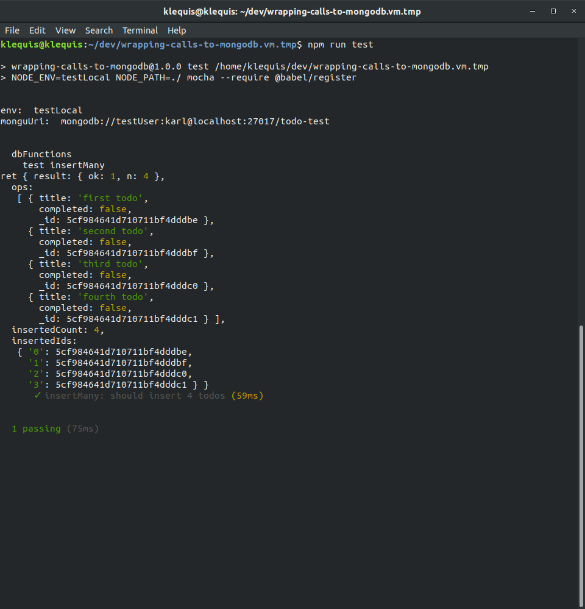

# `insertMany`

## Add `insertMany` to `db/dbFunctions.js`

```js
/**
 * 
 * @param {string} collection the name of a collection
 * @param {Array} data  an array of documents, without _id, to be inserted
 */
export const insertMany = async (collection, data) => {
  try {
    const { db } = await connectDB()
    const ret = await db.collection(collection).insertMany(data)
    console.log('ret', ret)
    // return formatReturnSuccess(????)
  }
  catch (e) {
    return formatReturnError('insertMany', e)
  }
}
```

The body of all the functions in `db/dbFunctions.js` will all be similar.

Get an instance of the db:
```js
const { db } = await connectDB()
```

Call the native driver function and store the return value in a variable named `ret`:
```js
const ret = await db.collection(collection).insertMany(data)
```

Call `formatRerutnSuccess` passing the part of the returned data we want to return to the caller, and return that value. We are currently in the process of discovering what to pass to `formatReturnSuccess`. Since the native drivers functions don't all return the same result shape, we will need to do this for each function.
```js
// return formatReturnSuccess(????)
```

If there is an error, pass the wrapper function name and the error to `formatReturnError` which formats the return value, and return it to the caller
```js
return formatReturnError('insertMany', e)
```

## Export `insertMany` in `db/index.js`

__db/index.js__

```js
export { 
  close
  insertMany // added
} from './dbFunctions'
```

## Import insertMany into `test/dbFunctions.test.js`

```js
import { 
  insertMany // added
} from 'db'
```

This is a test stub which may not be an official term, but it serves the purpose of calling the wrapper function so that we can log and examine the return value of the native driver frunction.

__db/dbFunctions.test.js__
```js
describe('test insertMany', function() {
  it('insertMany: should insert 4 todos', async function() {
    const i = await insertMany(collectionName, fourTodos)
  })
})
```

Run the test

```console
npm test
```

The output in the terminal should look like this:


## Return Value

Let's take a closer look at the return value.

`inserMany` returns an object with four properties:
- `result`: is an object that tells us the query was 'ok' and that it returned 4 documents.
- `ops`: is an array of the inserted values and what we will want to return to the caller.
- `insertedCount`: is the number of inserted documents.
- `insertedIds`: is an object containing the ids of the 4 inserted documents.

```js
{ result: { ok: 1, n: 4 },
  ops:
   [ { title: 'first todo',
       completed: false,
       _id: 5ce2abbbb647ec4022322bc3 },
     { title: 'second todo',
       completed: false,
       _id: 5ce2abbbb647ec4022322bc4 },
     { title: 'third todo',
       completed: false,
       _id: 5ce2abbbb647ec4022322bc5 },
     { title: 'fourth todo',
       completed: false,
       _id: 5ce2abbbb647ec4022322bc6 } ],
  insertedCount: 4,
  insertedIds:
   { '0': 5ce2abbbb647ec4022322bc3,
     '1': 5ce2abbbb647ec4022322bc4,
     '2': 5ce2abbbb647ec4022322bc5,
     '3': 5ce2abbbb647ec4022322bc6 } }

```


Again, the part we want to return is `ops`:
```js
ops:
   [ { title: 'first todo',
       completed: false,
       _id: 5ce2abbbb647ec4022322bc3 },
     { title: 'second todo',
       completed: false,
       _id: 5ce2abbbb647ec4022322bc4 },
     { title: 'third todo',
       completed: false,
       _id: 5ce2abbbb647ec4022322bc5 },
     { title: 'fourth todo',
       completed: false,
       _id: 5ce2abbbb647ec4022322bc6 } ],
```

The return in `insertMany` will be:
```js
return formatReturnSuccess(ret.ops)
```

And the final function is:
```js
export const insertMany = async (collection, data) => {
  try {
    const { db } = await connectDB()
    const ret = await db.collection(collection).insertMany(data)
    return formatReturnSuccess(ret.ops)
  }
  catch (e) {
    return formatReturnError('insertMany', e)
  }
}
```

Now lets finish the test by testing the return value. Add the line:
```js
expect(i.data.length).to.equal(4)
```

The complete test is:

__db/dbFunctions.test.js__
```js
describe('test insertMany', function() {
  it('insertMany: should insert 4 todos', async function() {
    const i = await insertMany(collectionName, fourTodos)
    expect(i.data.length).to.equal(4)
  })
})
```